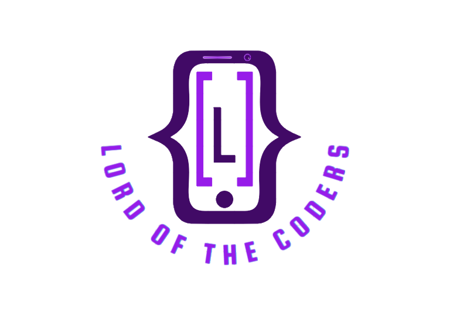

# Lord of the Coders



## [See the App!](https://lord-of-the-coders.netlify.app/)

## Description

This is an app to help coders resolving issues in their code. Different languages can be targeted and everybody can share their solutions.

## User Stories

- **404**: As an anon/user I can see a 404 page if I try to reach a page that does not exist so that I know it's my fault
- **Signup**: As an anon I can sign up in the platform so that I can start asking questions and helping coders
- **Login**: As a user I can login to the platform so that I can see the questions and start sharing questions or answers
- **Feed**: As a user I can see all the questions created and filter them by languages
- **Add a question**: As a user I can add a new question and insert a file to it
- **Add answers**: As a user I can answer to a specific question to help another user
- **See my profile**: As a user I can see my profile and the questions I posted
- **Update my profile**: As a user I can update my profile to specify the languages I use, my level and from where I come

## Backlog

- Logout
- Link to user's profile while clicking on the photo
- Make the share button usable
- Display answers of the user on his profile page
- Send message to a specific user through a chatbox
- Search bar on the feed

# Client / Frontend

## React Router Routes (React App)

| Path |   Page   |   Permissions    |   Behavior   |
| :--: | :------: | :--------------: | :----------: |
| `/`  | Homepage | public `<Route>` | Welcome page |
| `/signup`  | SignUp | public `<Route>` | Signup form, link to login, navigate to homepage after signup |
| `/login`  | Login | public `<Route>` | Login form, link to signup, navigate to homepage after login |
| `/feed`  | Feed | user only `<PrivateRoute>` | Show all the user's questions and the users |
| `/feed/:questionId`  | QuestionDetailsPage | user only `<PrivateRoute>` | Show a specific question and it's answers. We're also able to write an answer to the question |
| `/users`  | Profile | user only `<PrivateRoute>` | Profile page for the authenticated user, where they can view the questions they asked and also the ":zahnrad:SETTINGS" button to update their information |
| `/questions/new`  | PostYourQuestion | user only `<PrivateRoute>` | The user can create a new question |
| `/users/update`  | UpdateUserPage | user only `<PrivateRoute>` | The user can update their information (username, email, country, programming language and level) |

## Components, pages and context

- Signup
- Login
- Feed
- Homepage
- Postyourquestion
- Profile
- QuestionDetailsPage
- UpdateUserPage

- Navbar
- AllAnswers
- PrivateRoute

- AuthContext


# Server / Backend

## Models

User Model

```
{
username: {
type: String,
required: [true, "Username is required."],
unique: true,
lowercase: true,
trim: true,
},
email: {
type: String,
required: [true, "Email is required."],
unique: true,
lowercase: true,
trim: true,
},
password: {
type: String,
required: [true, "Password is required."],
},
languages: {
type: [String],
enum: ["JavaScript", "Python", "Java", "C++", "C#"],
},
country: { type: String },
level: { type: [String],
enum: ["Learner", "Junior", "Senior"]
},
photo: {
type: String,
default:
"https://digimedia.web.ua.pt/wp-content/uploads/2017/05/default-user-image.png",
}
}
{ timestamps: true}
```

Question Model

```
{
owner: { type: Schema.Types.ObjectId, ref: "User" },
title: { type: String, required: [true, "Title is required."] },
text: { type: String, required: [true, "Text is required."] },
languages: {
type: [String],
enum: ["JavaScript", "Python", "Java", "C++", "C#"],
},
image: {
type: String,
},
answers: [{ type: Schema.Types.ObjectId, ref: "Answer" }]
},
{ timestamps: true}
```

Answer Model

```
{
owner: { type: Schema.Types.ObjectId, ref: "User" },
question: {type: Schema.Types.ObjectId, ref: "Question" },
text: { type: String, required: [true, "Text is required."] },
image: { type: String },

},
{ timestamps: true}
```

## API Endpoints (backend routes)

| HTTP Method |                URL                 |          Request body           | Success status | Error status |                                                           Description                                                           |
| :---------: | :--------------------------------: | :-----------------------------: | :------------: | :----------: | :-----------------------------------------------------------------------------------------------------------------------------: |
|     GET     |              `/auth`               |          Saved session          |                |              |                                                   Check if user is logged in                                                    |
|    POST     |           `/auth/signup`           |   {username, email, password}   |      201       |     400      | Checks if fields not empty (422) and user not exists (409), then create user with encrypted password, and store user in session |
|    POST     |           `/auth/login`            |      {username, password}       |      200       |     400      |       Checks if fields not empty (422), if user exists (404), and if password matches (404), then stores user in session        |
|     GET     |          `/api/questions`          |                                 |      201       |     500      |                                               Show all the questions in the feed                                                |
|    POST     |        `/api/questions/new`        | {title, text, languages, image} |      201       |     500      |                                                       Add a new question                                                        |
|     GET     |    `/api/questions/:questionId`    |                                 |      201       |     400      |                                                  Show details of one question                                                   |
|   DELETE    |    `/api/questions/:questionId`    |                                 |      200       |     500      |                                                         Delete question                                                         |
|     GET     |      `/api/questions/answers`      |                                 |      201       |     500      |                                             Show answers about a specific question                                              |
|    POST     | `/api/questions/answers/:answerId` |          {text, image}          |      200       |     500      |                                                          Add an answer                                                          |
|     GET     | `/api/questions/answers/:answerId` |                                 |      201       |     400      |                                 Show a specific answer with user and question details populated                                 |
|   DELETE    | `/api/questions/answers/:answerId` |                                 |      204       |     500      |                                                        Delete one answer                                                        |
|     GET     |            `/api/users`            |                                 |      200       |     500      |                                                       Show all the users                                                        |
|     GET     |        `/api/users/:userId`        |                                 |      201       |     404      |                                                    Show details of one user                                                     |
|     GET     |   `/api/users/:userId/questions`   |                                 |      201       |     400      |                                            Show questions posted by a specific user                                             |
|     PUT     |        `/api/users/:userId`        |   {languages, level, country}   |      200       |     400      |                                                Update data from a specific user                                                 |
|   DELETE    |        `/api/users/:userId`        |                                 |      204       |     500      |                                                         Delete profile                                                          |

# Links

## Collaborators

[Alice Pennec](https://github.com/alicepennec)

[Marina Muñoz](https://github.com/marinamun)

[Telma Coelho]()

[Raheleh Bayat](https://github.com/raheleh-bayat)

## Git

[Server Repository Link](https://github.com/marinamun/backend-coders-forreal)

[Client Repository Link](https://github.com/marinamun/frontend-project-coders)

[Deploy Link](https://lord-of-the-coders.netlify.app/)

## Slides

[Slides Link]()
